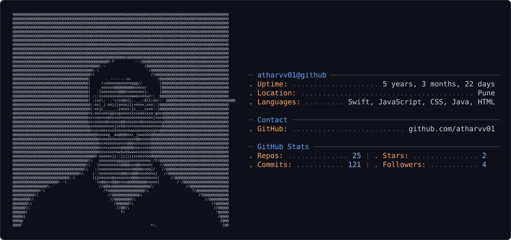

<picture>
  <source media="(prefers-color-scheme: dark)" srcset="dark_mode.svg" />
  <source media="(prefers-color-scheme: light)" srcset="light_mode.svg" />
  
</picture>

<p align="center">
  <a href="https://linkedin.com/in/atharva-zanwar-117b7b211"></a>
</p>

<p align="center">
  
</p>

```ts
const atharva = {
  pronouns:   ["he", "him", "works-on-my-machine"],
  currently:  "rewriting code that already worked fine",
  superpower: "googling error messages with great confidence",
  weakness:   "naming things, off-by-one errors, and naming things",
  fuel:       "chai (the build fails without it)",
  process:    "explain it in English, let Claude cook, keep ~10 good lines",
  ships_when: "'git commit -m fix' starts to feel like a plan",
};
```

### 🧑‍💻 today's standup, attendance mandatory

<p align="left">
  
</p>

<p align="left">
  &nbsp;&nbsp;&nbsp;&nbsp;<sub><i>(lol they handle it)</i></sub>
</p>

<p align="left">
  
</p>
